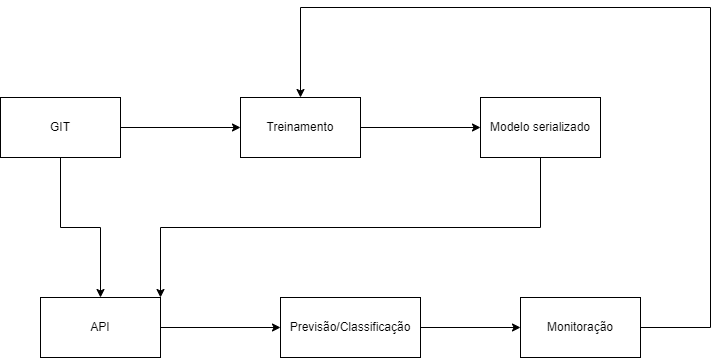

# Modelo de deploy

Optei por descrever o processo na cloud do Google (GCP) por ter maior 
familiaridade com os nomes dos serviço dela.

O modelo de deploy serguirá o diagrama abaixo.

## Fluxo

O fluxo que pensei para um deploy de modelos seguiria basicamente os seguintes passos:

1. GIT
2. Treinamento
3. Modelo serializado
4. API
5. Previsão / Classificação
6. Monitoração

## GIT

Após finalizar o código e testes, um merge na master acionaria um processo de CI/CD que acionaria
o treinamento do modelo e a atualização da API.

## Treinamento

O treinamento ocorreria na nuvem (uma máquina virtual GCE ou kubernetes GKE), sendo acionado pelo CI/CD.
Ao final do treinamento, o modelo é serializado (pickle, joblib, etc.) e armazenado em um bucket (GCS).

## API

O CI/CD também atualiza a API para que carregue o modelo serializado mais atual. Esta API poderia
ser uma Cloud Function, se for leve, ou uma Cloud Run para aproveitar os benefícios dos serviços
serverless da cloud.

## Previsão / Classificação

A previsão / classificação ocorrem por requisições à API e seus resultados são armazenados em
alguma base de dados analítica, como o BigQuery, para análises posterior.

## Monitoramento

Um serviço de monitoração acompanha as métricas das previsões e apresenta suas evoluções
em um dashboard. No caso de significativa degradação das métricas de desempenho, um job pode
ser automaticamente acionado para retreinar o modelo com dados mais atuais, além de alertas
para que o time de ciência de dados possa analisar o caso.